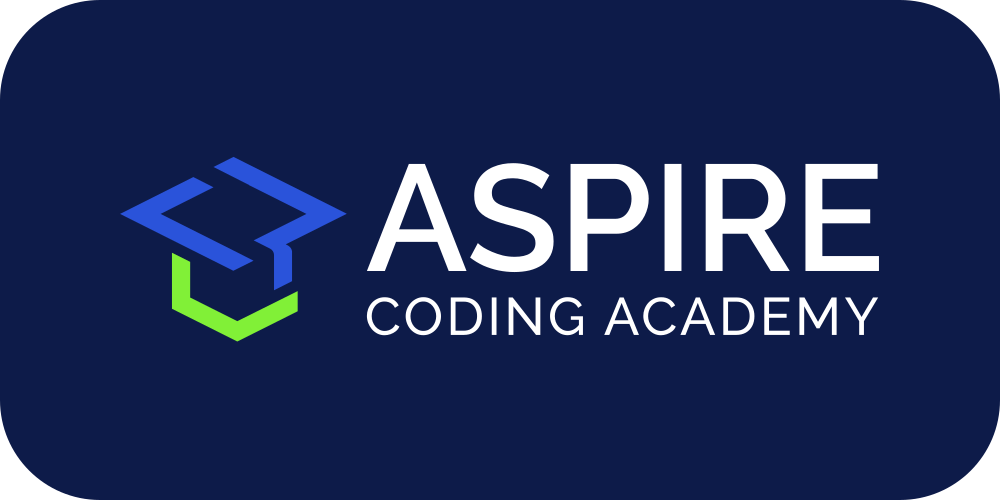

<!--
MIT License

Copyright (c) 2025 Aspire Coding Academy LLC

Permission is hereby granted, free of charge, to any person obtaining a copy
of this software and associated documentation files (the "Software"), to deal
in the Software without restriction, including without limitation the rights
to use, copy, modify, merge, publish, distribute, sublicense, and/or sell
copies of the Software, and to permit persons to whom the Software is
furnished to do so, subject to the following conditions:

The above copyright notice and this permission notice shall be included in all
copies or substantial portions of the Software.

THE SOFTWARE IS PROVIDED "AS IS", WITHOUT WARRANTY OF ANY KIND, EXPRESS OR
IMPLIED, INCLUDING BUT NOT LIMITED TO THE WARRANTIES OF MERCHANTABILITY,
FITNESS FOR A PARTICULAR PURPOSE AND NONINFRINGEMENT. IN NO EVENT SHALL THE
AUTHORS OR COPYRIGHT HOLDERS BE LIABLE FOR ANY CLAIM, DAMAGES OR OTHER
LIABILITY, WHETHER IN AN ACTION OF CONTRACT, TORT OR OTHERWISE, ARISING FROM,
OUT OF OR IN CONNECTION WITH THE SOFTWARE OR THE USE OR OTHER DEALINGS IN THE
SOFTWARE.

<!-- PROJECT LOGO -->
 

  
  <h1 align="center">invoice-parser</h1>

  
Parses PDF invoices into CSVs

<!-- TABLE OF CONTENTS -->

  
Table of Contents

  <ol>
    <li><a href="#about">About</a></li>
    <li><a href="#getting-started">Getting Started</a></li>
    <li><a href="#built-with">Built With</a></li>
    <li><a href="#contributing">Contributing</a></li>
    <li><a href="#license">License</a></li>
    <li><a href="#contact">Contact</a></li>
    <li><a href="#acknowledgments">Acknowledgments</a></li>
  </ol>

## About

This repository is part of [Aspire Coding Academy][aspirecodingacademy-url]'s [WIP Initiative][wip-initiative-url].

Manual invoice management is inefficient. Save time by managing your own invoice templates with a bulk invoice parser.

This uses [invoice2data][invoice2data-url] on a simple flask app to take in files from the user and output them to a single CSV. The user defines the invoice2data templates.

[![Screen Shot][product-screenshot]]

## Getting Started

1. `pip install -r requirements.txt`
2. `python run.py`

## Built With

[![Python][python-shield]][python-url]\
[![Flask][flask-shield]][flask-url]\
[![invoice2data][invoice2data-shield]][invoice2data-url]\
[![HTML5][html-shield]][html-url]\

## Contributing

Thank you for your interest in contributing to this project. Open source projects are a beautiful picture of collaboration and generosity. Please raise items for discussion using the links below, via a pull request, or by email.

[Request Feature][feature-request-url] 
[Report Bug][bug-report-url]

## License

[![License][license-shield]][license-url]

## Contact

[contact@aspirecodingacademy.com](mailto:hello@aspirecodingacademy.com)

## Acknowledgments

-   [invoice2data][invoice2data-url]
    -   For the invoice parsing library
-   [othneildrew/Best-README-Template][readme-template-url]
    -   For the README template

<!-- MARKDOWN LINKS -->
<!-- https://www.markdownguide.org/basic-syntax/#reference-style-links -->

<!-- aca -->

[aspirecodingacademy-url]: https://aspirecodingacademy.com
[wip-initiative-url]: https://github.com/aspirecodingacademy/wip-initiative

<!-- repo -->

[feature-request-url]: https://github.com/aspirecodingacademy/python-appetizers/issues/new?labels=enhancement&template=feature-request---.md
[bug-report-url]: https://github.com/aspirecodingacademy/python-appetizers/issues/new?labels=bug&template=bug-report---.md

<!-- about -->

[product-screenshot]: readme-assets/screenshot.png

<!-- usage -->

[usage-screenshot]: readme-assets/screenshot.png

<!-- built_with -->

[python-shield]: https://img.shields.io/badge/python-3670A0?style=for-the-badge&logo=python&logoColor=ffdd54
[python-url]: https://python.org/
[react-shield]: https://img.shields.io/badge/React-20232A?style=for-the-badge&logo=react&logoColor=61DAFB
[react-url]: https://reactjs.org/
[markdown-shield]: https://img.shields.io/badge/markdown-%23000000.svg?style=for-the-badge&logo=markdown&logoColor=white
[markdown-url]: https://www.markdownguide.org/
[flask-shield]: https://img.shields.io/badge/Flask-000000?style=for-the-badge&logo=flask&logoColor=white
[flask-url]: https://flask.palletsprojects.com/
[invoice2data-shield]: https://img.shields.io/badge/invoice2data-000000?style=for-the-badge&logo=invoice2data&logoColor=white
[invoice2data-url]: https://github.com/invoice-x/invoice2data
[html-shield]: https://img.shields.io/badge/HTML5-E34F26?style=for-the-badge&logo=html5&logoColor=white
[html-url]: https://developer.mozilla.org/en-US/docs/Web/HTML

<!-- license -->

[license-shield]: https://img.shields.io/github/license/aspirecodingacademy/python-appetizers.svg?style=for-the-badge
[license-url]: https://github.com/aspirecodingacademy/python-appetizers/blob/master/LICENSE.txt

<!-- acknowledgements -->

[readme-template-url]: https://github.com/othneildrew/Best-README-Template
